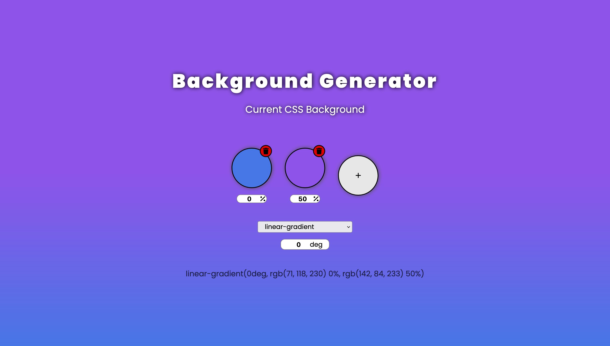

# Background Generator 


This is a background generator that helps front-end developers create and test their gradient background with different percentages, rotations, and up to 4 different colors.

## Table of contents

- [Overview](#overview)
  - [The challenge](#the-challenge)
  - [Screenshot](#screenshot)
    - [Desktop Layout](#desktop-layout)
    - [Tablet Layout](#tablet-layout)
    - [Mobile Layout](#mobile-layout)
  - [Links](#links)
- [My process](#my-process)
  - [Built with](#built-with)
  - [What I learned](#what-i-learned)
  - [Continued development](#continued-development)
  - [Useful resources](#useful-resources)
- [Author](#author)
- [To-Do](#to-do)

## Overview

### The challenge

Users should be able to:

- Select up to 4 different colors to add to the gradient
- See the gradient as a background
- Copy and paste de line of code for the gradient from the page
- Select different percentage value for each color
- Delete selected colors
- Add more colors

### Screenshot

<p align="center">
  
</p>

### Links

- Website URL: [To Implement](#to-do)

## My process

### Built with

- Semantic HTML5 markup
- CSS custom properties
- Flexbox
- CSS Grid
- Vanilla JavaScript

### What I learned

The main porpuse of this project was to be able to manipulate the DOM with only Vainilla JS getting a better understanding and coding experience using plain JavaScript before using any kind of frameworks or libraries. For that I used functions, arrays and variables to get hold of the DOM and make it cleaner:

- Variables

```js
const body = document.querySelector("body");
const inputColors = document.querySelectorAll(".color-input");
const colorFront = document.querySelectorAll(".color-front");
const colorPercent = document.querySelectorAll(".color-percent-select");

let typeGradient = selectGradient.value;
let degrees = Number(inputDegree.value);

const wheelLimit = 4;
let numberWheels;
```

- Arrays

```js
const listColors = [];
const listPercentColors = [];


listColors.push(color.style.backgroundColor);
listPercentColors.push(percent.value);

listColors[i]=color;
listPercentColors[k]=percentValue;

listColors.splice(l,1);
listPercentColors.splice(l,1);

```
- Functions
```js

function addInputColorEvent(inputColor, colorFront, i){
    colorFront.style.backgroundColor = inputColor.value;
    inputColor.addEventListener("input",(e)=>{
        let color = e.target.value;
        colorFront.style.backgroundColor=color;
        listColors[i]=color;
        addGradientBackground();
    });
}

function deleteColorWheelEvent(del, l){
    del.addEventListener("click", ()=>{
        if (numberWheels>2){
            del.parentElement.remove();
            listColors.splice(l,1);
            listPercentColors.splice(l,1);
            numberWheels--;
            console.log(numberWheels);
            addGradientBackground();
        }
        if (numberWheels === (wheelLimit-1)){
            buttonAdd.style.display="flex";
        }
    });
}

```
- Create Elements
```js
function createColorWheel(numberAdded){
    // Create a color selection element
    let colorSelection =  document.createElement("div");
    colorSelection.classList.add("color-selection");

    let deleteBtn = document.createElement("div");
    deleteBtn.classList.add("btn-delete");

    let btnLogo = document.createElement("i");
    btnLogo.classList.add("fa-solid", "fa-trash");
    deleteBtn.appendChild(btnLogo);
    deleteColorWheelEvent(deleteBtn, numberAdded-1);
    colorSelection.appendChild(deleteBtn);

    let colorFront = document.createElement("span");
    colorFront.setAttribute("id", ( "color-front"+ numberAdded ) );
    colorFront.classList.add("color-front");
    

    let inputColor = document.createElement("input");
    inputColor.classList.add("color-input");
    inputColor.setAttribute("type","color");
    inputColor.setAttribute("name",( "color" + numberAdded ));
    inputColor.setAttribute("value", "#ffffff" );
    
    addInputColorEvent(inputColor, colorFront, numberAdded-1);
    addColorFrontEvent(colorFront,inputColor)
    colorSelection.appendChild(inputColor);
    colorSelection.appendChild(colorFront);

    let colorPercent = document.createElement("span");
    colorPercent.classList.add("color-percent");

    let inputPercent = document.createElement("input");
    inputPercent.classList.add("color-percent-select");
    inputPercent.setAttribute("type", "text");
    inputPercent.setAttribute("value","100");
    inputPercent.setAttribute("name", ( "color" + numberAdded + "-percent" ) );
    colorPercent.appendChild(inputPercent);

    let percentLogo = document.createElement("i");
    percentLogo.classList.add("fa-solid", "fa-percent", "percentage");
    colorPercent.appendChild(percentLogo);

    addPercentColorEvent(inputPercent, numberAdded-1);
    colorSelection.appendChild(colorPercent);

    allColors.appendChild(colorSelection);
    addGradientBackground();
}
```

### Continued development

Through the challenge I learn a lot about creating new elements to make the page more dynamic as well as selecting these elements through events. I used arrays and variables, but I would love to refine my abilities by using objects instead, for clearer code.

### Useful resources

- [MDN Web Docs](https://developer.mozilla.org/en-US/docs/Web/API/Document/createElement) - This website has a lot of documentation about the use of Vanilla JavaScript, HTML and CSS wich help me with the manipulation of the DOM.

- [StackOverflow Round Input Color](https://stackoverflow.com/questions/48832432/rounded-input-type-color) - This is a Stack Overflow question that has a "hack" to make the inputs that are of the type of color round. This helps give it a better look instead of the default rectangular ones.

## Author

- Website - [Hugo S Juarez P](#to-do)
- Linkedin - [Hugo Juarez](https://www.linkedin.com/in/hugo-juarez-934787269/)

## To-Do

- [x] Finish the challenge
- [ ] Make portfolio website
- [ ] Upload it to the portfolio website